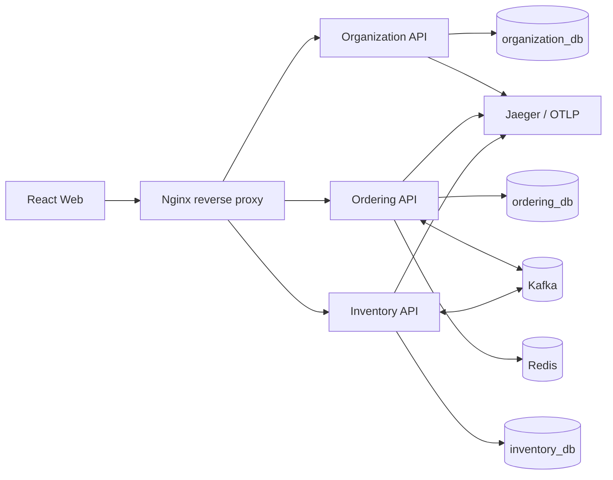
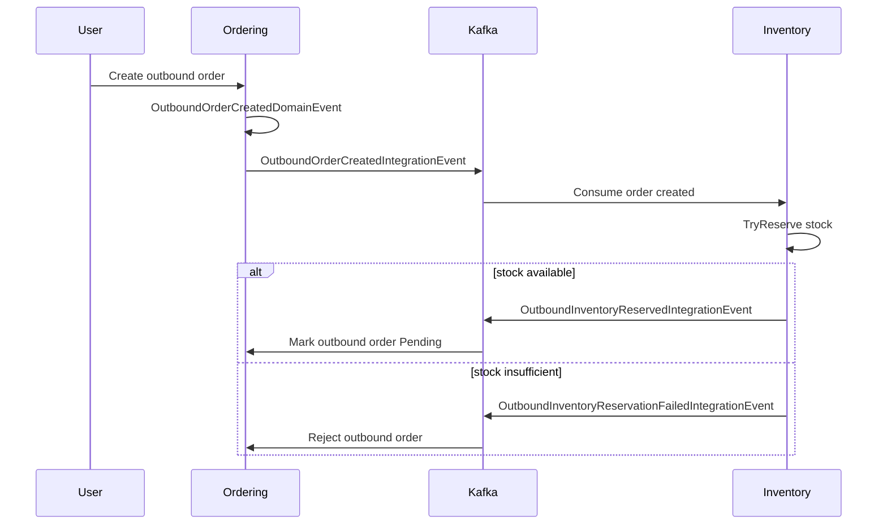

<p align="center">
  
</p>

<h1 align="center">IMS Microservices</h1>

<p align="center">
  以 Domain-Driven Design 打造的庫存管理微服務範例，使用 .NET、PostgreSQL、Kafka、Redis 與 React。
</p>

<p align="center">
  <strong>Organization</strong> · <strong>Ordering</strong> · <strong>Inventory</strong> · <strong>Web</strong>
</p>

---

## 專案概覽

IMS Microservices 是一套以業務邊界為核心設計的庫存管理系統。這個專案示範如何用 Domain-Driven Design（DDD）把倉庫、訂單、庫存、身份與跨服務整合規則清楚地放進程式碼，而不是讓規則散落在 Controller、SQL 或流程腳本裡。

系統切成三個後端服務：

| 服務 | 職責 | 核心概念 |
| --- | --- | --- |
| Organization | 身份、倉庫、使用者、JWT issuer、JWKS | User, Role, Warehouse, RefreshToken |
| Ordering | 商品、入庫單、出庫單、訂單歷程 | Product, ProductUnit, InboundOrder, OutboundOrder |
| Inventory | 庫存狀態與庫存異動反應 | Stock, reservation, release, shipment counters |

每個服務擁有自己的資料庫 schema 與 API。服務之間透過 Kafka integration events 協作，不直接共用資料表。

> [!NOTE]
> 專案刻意把業務規則放在 Domain/Application 層，再由 Infrastructure 接 PostgreSQL、Kafka、Redis、JWT 與 observability。這讓業務模型更容易被主管、PM、倉儲人員與工程師共同討論，也降低後續變更成本。

## 為什麼適合用 DDD

這個系統不是單純 CRUD。它包含多個容易在傳統分層架構中被稀釋的業務規則：

- 只有 WarehouseUser 可以建立入庫/出庫單。
- WarehouseAdmin 負責確認或拒絕倉庫訂單。
- 出庫單建立後會先進入 `Processing`，等待 Inventory 非同步嘗試預留庫存。
- 庫存預留成功後，出庫單變成 `Pending`；預留失敗則由系統自動拒絕。
- 入庫/出庫確認後會發布事件，讓 Inventory 更新庫存。
- 查詢模型與歷程查詢可以和寫入規則分開優化。

DDD 讓這些規則有明確的位置：

- **Aggregate** 保護狀態轉換：`InboundOrder`、`OutboundOrder`、`Product`、`Stock`、`User`。
- **Application Handler** 表達 use case：建立入庫單、確認出庫單、查詢庫存、註冊使用者。
- **Domain Event** 表示服務內發生的重要業務事實。
- **Integration Event** 表示跨服務需要同步的業務事實。
- **Repository / Unit of Work** 將 persistence 細節隔離在基礎設施層。

## 架構

```text
src/
  Organization/
    Api/             HTTP endpoints, auth, OpenAPI, health checks
    Domain/          User, Role, Warehouse, RefreshToken
    Infrastructure/  JWT, password hashing, Dapper repositories, seed data

  Ordering/
    Api/             Product, inbound, outbound APIs
    Application/     Commands, queries, event handlers, caching decorators
    Domain/          Product, InboundOrder, OutboundOrder aggregates
    Infrastructure/  PostgreSQL, Kafka, Redis, Outbox

  Inventory/
    Api/             Stock APIs
    Application/     Stock queries and integration event handlers
    Domain/          Stock aggregate
    Infrastructure/  PostgreSQL, Kafka, Inbox, Outbox

  MessageContract/   跨服務 integration event contracts
  SharedKernel/      AggregateRoot, Entity, domain event, UnitOfWork
  Web/               React + Vite frontend
```

### Runtime View



### 事件流程



## 使用的設計模式

- **Bounded Context**：Organization、Ordering、Inventory 依業務能力切開。
- **Clean Layering**：Domain 不依賴 API 或 Infrastructure。
- **Minimal APIs**：Endpoint group 對應實際 use case。
- **Outbox Pattern**：先把 integration message 寫入資料庫，再非同步發布到 Kafka。
- **Inbox Pattern**：Inventory 消費事件時避免重複處理。
- **Explicit Authorization Policies**：Admin、WarehouseAdmin、WarehouseUser 權限流程清楚分離。
- **Read Optimization**：Ordering 使用 Redis 快取部分歷程查詢。
- **Observability**：OpenTelemetry 追蹤 API、HTTP、PostgreSQL 與 messaging 活動。

## 技術棧

| 類別 | 技術 |
| --- | --- |
| Backend | .NET 11 preview, ASP.NET Core Minimal APIs |
| Persistence | PostgreSQL, Dapper, SQL migrations |
| Messaging | Kafka, Confluent.Kafka |
| Cache | Redis |
| Auth | JWT bearer tokens, RSA signing, JWKS endpoint |
| Observability | OpenTelemetry, Jaeger |
| Frontend | React, TypeScript, Vite, Tailwind CSS |
| Testing | xUnit, WebApplicationFactory, Testcontainers |
| Local runtime | Docker Compose |

> [!IMPORTANT]
> 此專案目標框架是 `.NET 11 preview`。本機 build 或測試時請使用相容 SDK/runtime。

## 快速開始

### 前置需求

- Docker and Docker Compose
- .NET 11 preview SDK
- Node.js 22+ and pnpm（若要在 Docker 外跑前端）
- `curl` 與 `jq`（若要跑 smoke-test scripts）

### 使用 Docker Compose 啟動

先建立或更新 `.env`，再啟動整套服務：

```bash
docker compose up --build
```

預設對外 port：

| Component | URL |
| --- | --- |
| Web / reverse proxy | http://localhost |
| Organization API | http://localhost:5032 |
| Ordering API | http://localhost:5116 |
| Inventory API | http://localhost:5205 |
| Jaeger UI | http://localhost:16686 |
| PostgreSQL | localhost:5432 |
| Kafka | localhost:9092 |
| Redis | localhost:6379 |

Health checks：

```bash
curl http://localhost:5032/healthz
curl http://localhost:5116/healthz
curl http://localhost:5205/healthz
```

### OpenAPI

三個 API 都有 versioned OpenAPI 文件：

```text
http://localhost:5032/openapi/v1.json
http://localhost:5116/openapi/v1.json
http://localhost:5205/openapi/v1.json
```

## Smoke Tests

`scripts/` 底下的腳本會用真實 HTTP request 跑主要業務流程。

執行完整情境：

```bash
./scripts/run-all.sh
```

或執行單一端到端 happy path：

```bash
./scripts/happy-path-smoke-test.sh
```

Smoke path 會涵蓋：

1. Admin 登入。
2. 建立倉庫。
3. 建立 WarehouseAdmin 與 WarehouseUser。
4. 建立商品單位與商品。
5. 建立並確認入庫單。
6. 透過 Kafka 更新 Inventory 庫存。
7. 建立出庫單並預留庫存。
8. 查詢庫存驗證結果。

## 測試策略

測試依信心層級分開：

```text
tests/
  UnitTests/         Domain 與聚焦的 application/infrastructure 行為
  IntegrationTests/  Repository、Kafka、Redis、database 行為
  ApiTests/          使用 WebApplicationFactory 驗證 HTTP endpoint 行為
```

Integration/API tests 使用 Testcontainers 管理外部依賴，讓 domain tests 保持快速，也讓 persistence/messaging tests 更貼近真實環境。

## 專案文件

PlantUML 圖放在 `docs/`：

```text
docs/
  organization/aggregates.puml
  ordering/aggregates.puml
  ordering/usecase/*.puml
  inventory/aggregates.puml
  inventory/usecase/*.puml
```

這些圖很適合用來跟主管或非工程角色說明 DDD model 與服務協作。

## 推動 DDD 的重點

- **業務語言直接出現在程式碼裡**：類別與 use case 對應倉庫、訂單、庫存語彙。
- **變更影響範圍較小**：庫存規則可以演進，不需要直接改 Ordering 的資料表。
- **跨服務整合是明確契約**：Kafka event contracts 說明服務如何協作。
- **規則可測試**：aggregate state transition 不需要啟動整套系統就能驗證。
- **技術細節可替換**：Dapper、Kafka、Redis、JWT 都是包在 domain 外層的 adapter。

## 目前的取捨

這是一個務實的 DDD 實作，不是框架展示：

- SQL migrations 使用 plain `.sql` files。
- Persistence 使用 Dapper，而不是 ORM。
- Minimal APIs 讓 endpoint mapping 貼近 use case。
- Message contracts 透過 project reference 共用，以換取開發速度。

> [!TIP]
> 若要往 production hardening 前進，下一步可以優先補強 domain validation、schema check constraints、多 instance Outbox locking、RSA key secret management，以及 CI 內的 tests/migrations 驗證。
