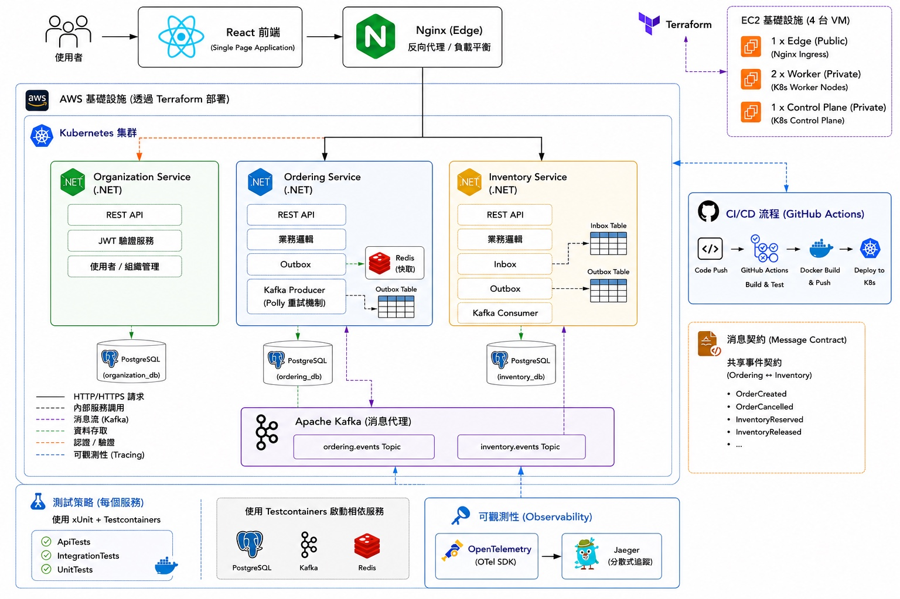
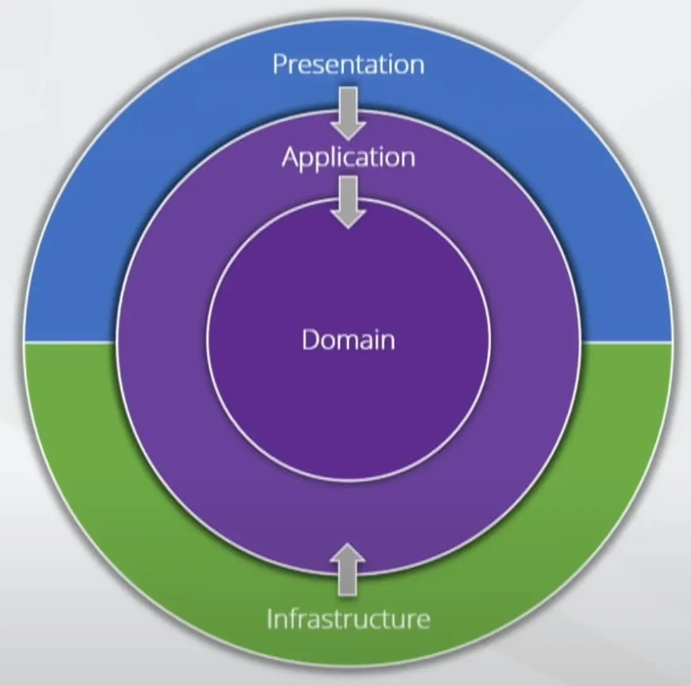
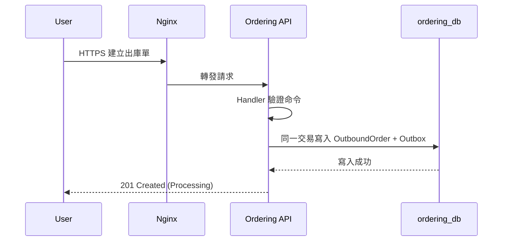
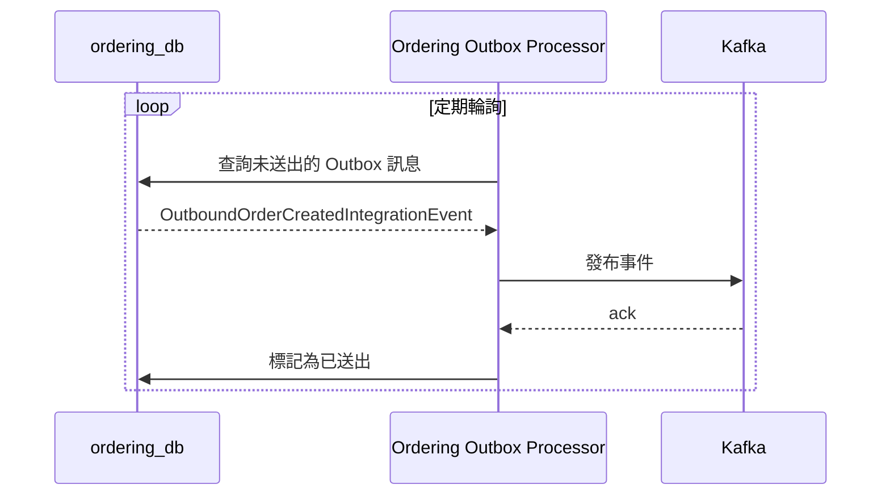
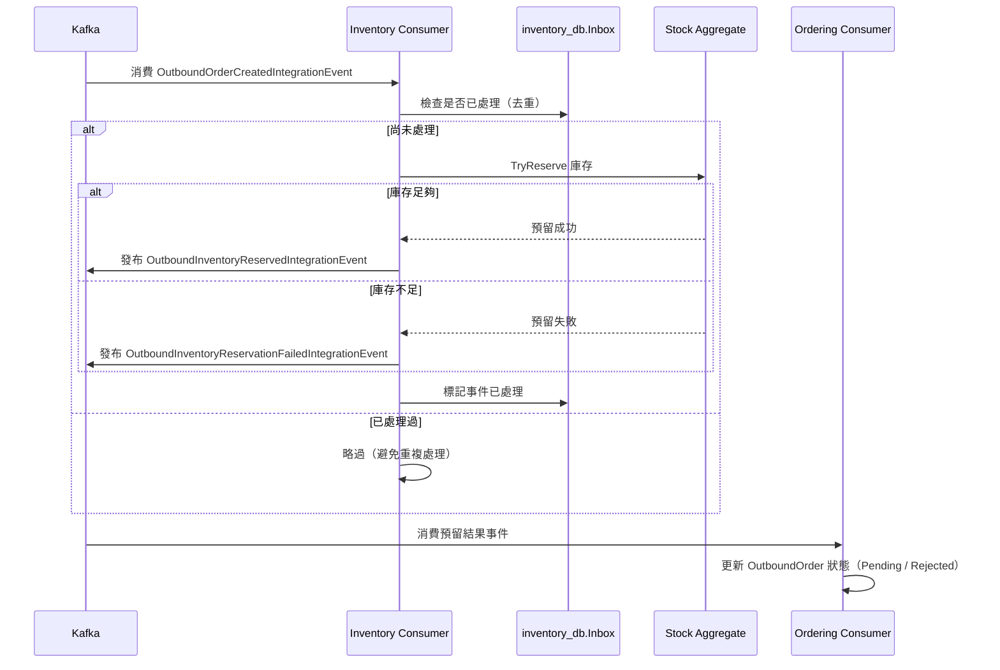

<p align="center">
  
</p>

<h1 align="center">IMS Microservices</h1>

## 專案概覽

IMS Microservices 是一套以 DDD 為架構的庫存管理系統，核心功能有：

- **出/入庫歷程查詢**：可追蹤每一筆入庫、出庫紀錄。
- **人員管理**：可建立倉管人員（WarehouseAdmin）與一般工作人員（WarehouseUser）帳號，依角色賦予不同權限。
- **出入庫申請流程**：工作人員可申請入庫單、出庫單，經倉管確認或拒絕後觸發後續庫存異動。



## Why DDD

DDD 的核心精神，是引導開發人員把問題視為「領域」（Domain），將每個獨立的業務問題劃分成一個 Bounded Context——例如「訂單」與「庫存」就是兩個獨立的 Bounded Context，各自處理自己的領域規則，並透過[統一語言](https://martinfowler.com/bliki/UbiquitousLanguage.html)（Ubiquitous Language）讓開發人員與領域專家用同一套詞彙討論問題。

DDD 聽起來很酷，但關鍵不在於套用這個模式本身，而在於程式碼的組織方式是否真的反映了業務規則與業務術語。簡單的 CRUD 應用套用 DDD 只會徒增複雜度；開發人員應該依照業務的實際複雜程度選擇架構——簡單的問題用簡單的架構解決，同時保留隨業務成長而擴展架構的彈性。

## Layer in DDD



### Domain

負責表示業務概念、業務規則，以及反應領域發生的事件，是 DDD 中的核心。該層只專注在業務，應該完全忽略基礎設施細節，例如 Database、Message Queue、Email 等等。

#### Aggregate

聚合（Aggregate）是 DDD 中的一種設計模式。

它是一組可以被視為單一整體（single unit）的領域物件（Domain Objects）。例如，一張訂單（Order）和它底下的訂單明細（OrderItem）是不同的物件，但在業務上，把「訂單連同所有明細」視為一個整體來管理會更加合理，因此它們共同組成一個聚合。

聚合中的其中一個物件會被指定為聚合根（Aggregate Root）。任何來自聚合外部的參考，都只能指向聚合根，而不能直接存取聚合內部的其他物件。如此一來，聚合根便能負責維護整個聚合的一致性與完整性（Integrity）。

#### Entity

具有明確身分（Identity）的物件。即使經過時間推移，或有不同的表示方式，它仍然是同一個物件。例如 Order，今天建立了一張訂單，Id 是 001，狀態是 Pending，明天訂單狀態為 Paid，他們還是同一個訂單，因為 Id 沒變。

#### Value Object

與 Entity 相反，當一個物件沒有概念上的標識（conceptual identity），我們只關心值物件「是什麼」，而不關心它是「哪一個」。

比如說 Money（100 元），我們不會去區分「這個 100 元」跟「那個 100 元」是不是同一個物件——只要兩個 Money 的金額與幣別相同（例如都是 100 元、TWD），就視為相等，可以互相替換。這種依「值」判斷相等，而不是依「身分」判斷相等，就是 Value Object 與 Entity 最根本的差異。

另外，Value Object 通常設計成不可變（Immutable）：一旦建立就不能修改內部狀態，如果需要「改變」，是建立一個新的 Value Object 取代舊的，而不是修改原本那個。

### Application

該層扮演「指揮家」的角色，負責定義軟體被期望完成的工作，並指揮 Domain Object 完成任務。它代表了對業務有意義的任務，或是與其他系統應用層互動的需求。

Application 層本身不處理業務邏輯，而是協調工作流程，將實際工作委派給下一層——Domain Object——來完成。雖然它不保存反映業務情況的狀態，但可以保存反映任務處理進度的狀態，讓客戶端了解目前執行到哪個步驟。

它也負責與其他系統的應用層進行必要的訊息交換，例如將 Domain Event 轉換成 Integration Event，通知其他服務。

### Infrastructure

Infrastructure 層為更高層級（Presentation、Application、Domain）提供技術能力，通常位於分層架構的最底層，作為技術支撐的基石。

它處理的是純技術問題，包括資料持久化、訊息傳遞（Messaging）、事務（Transaction）管理、網路協定/檔案處理等等。

Infrastructure 的功能雖然對系統運行至關重要，但它存在的目的是讓開發者能專注於核心領域（Core Domain）的設計，不被技術瑣事干擾。

### Presentation

Presentation 層是系統對外呈現與互動的介面，負責把使用者或外部系統的請求轉換成 Application 層看得懂的命令或查詢，再把結果轉換回使用者能理解的形式。它本身不包含業務邏輯，只負責溝通與轉譯。

在這個專案裡，Presentation 層分成兩部分：

- **Api**：HTTP endpoint，負責接收請求、驗證輸入、驗證身份與授權，轉交給 Application 層處理，再把結果序列化成回應。
- **Web**：React 前端，透過 Api 與後端服務互動，提供倉管人員與工作人員操作介面。

> Organization 服務因為職責單純（身份與使用者管理），沒有獨立的 Application 層，Handler 邏輯直接放在 Presentation 層。

## Bounded Context

依照 Bounded Context 拆分成三個獨立部署的服務：

- Organization：身份、使用者、倉庫管理
- Ordering：商品、入庫單、出庫單
- Inventory：庫存狀態與異動

服務與服務之間不共用資料庫，透過訊息契約（MessageContract）定義的 Kafka integration event 溝通。

## Ordering ↔ Inventory 溝通

Ordering 與 Inventory 不共用資料表，出庫單的庫存預留完全透過 Kafka integration event 非同步完成。整個流程拆成三個階段：入口同步請求、Outbox 非同步照布、Consumer 消費與狀態更新。

### 1. 入口同步請求

使用者建立出庫單時，Handler 與 Aggregate 的狀態變更、以及 Outbox 訊息的寫入，落在同一個資料庫交易裡。



### 2. Outbox 非同步照布

Outbox Processor 定期輪詢資料庫，把未送出的訊息發布到 Kafka，成功後才標記為已送出，避免訊息遺失。



### 3. Consumer 消費與狀態更新

Inventory Consumer 透過 Inbox 記錄避免重複處理，嘗試預留庫存後，把結果發布回 Kafka；Ordering Consumer 再消費結果事件，更新出庫單狀態。



---

## 技術棧

| 類別            | 技術              |
|---------------|-----------------|
| Backend       | .NET 11 preview |
| Persistence   | PostgreSQL      |
| Messaging     | Kafka           |
| Cache         | Redis           |
| Observability | OpenTelemetry   |
| Frontend      | React           |

## 部署架構

- Terraform：管理雲端基礎設施
- Kubernetes：容器編排與服務部署
- Docker：容器化打包

## 本地開發

### 前置需求

- Docker 與 Docker Compose
- .NET 11 preview SDK（若要在 Docker 外執行/開發後端）
- Node.js 22+ 與 pnpm（若要在 Docker 外跑前端）

### 環境變數與機密設定

專案根目錄需要一份 `.env`（已加入 `.gitignore`，不會被 git 追蹤），提供資料庫連線字串、JWT、Kafka、RSA 金鑰路徑等變數，`docker-compose.yml` 會讀取這些變數啟動各服務容器。

若要在 Docker 外直接用 `dotnet run` 啟動單一服務（例如接本機 IDE debug），三個 Api 專案都已設定 `UserSecretsId`，機密值改用 [.NET User Secrets](https://learn.microsoft.com/aspnet/core/security/app-secrets) 管理，不寫進 `appsettings.json`：

```bash
cd src/Organization/Api
dotnet user-secrets set "ConnectionStrings:DefaultConnection" "Host=127.0.0.1;Port=5432;Username=postgres;Password=password;Database=organization_db"
```

### 啟動

```bash
docker compose up --build
```

預設對外 port：

| Component | URL |
| --- | --- |
| Web / reverse proxy | http://localhost |
| Organization API | http://localhost:5032 |
| Ordering API | http://localhost:5116 |
| Inventory API | http://localhost:5205 |
| Jaeger UI | http://localhost:16686 |
| PostgreSQL | localhost:5432 |
| Kafka | localhost:9092 |
| Redis | localhost:6379 |

Health check：

```bash
curl http://localhost:5032/healthz
curl http://localhost:5116/healthz
curl http://localhost:5205/healthz
```

### API 文件

三個服務都有 versioned OpenAPI 文件：

```text
http://localhost:5032/openapi/v1.json
http://localhost:5116/openapi/v1.json
http://localhost:5205/openapi/v1.json
```

## Test

使用 xUnit 作為測試框架，搭配 Testcontainers 管理測試所需的外部依賴（PostgreSQL、Kafka、Redis）。

```text
tests/
  UnitTests/         Domain 與聚焦的 application/infrastructure 行為，不依賴外部服務，執行速度快
  IntegrationTests/  驗證 Repository、Kafka、Redis 等實際串接行為，透過 Testcontainers 啟動真實依賴
  ApiTests/          使用 WebApplicationFactory 對 HTTP endpoint 做端對端驗證
```

三個服務（Organization、Ordering、Inventory）各自擁有獨立的 UnitTest / IntegrationTest / ApiTest 專案。

